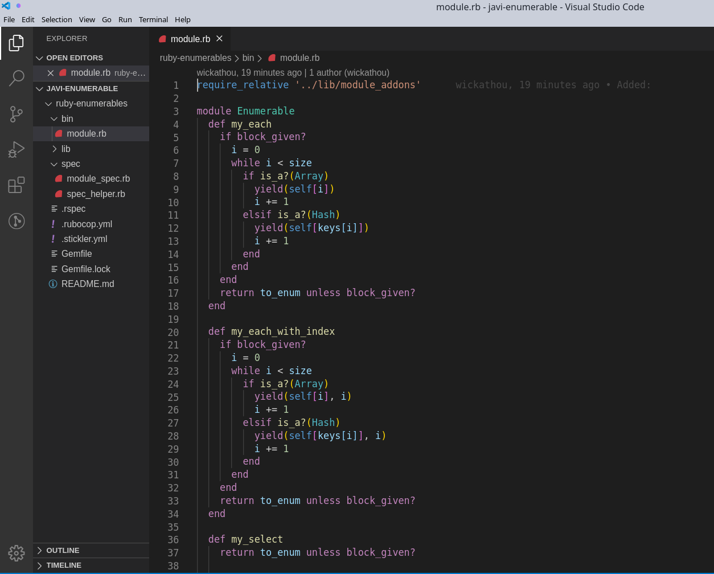

<!-- PROJECT LOGO -->
# ruby-enumerables
An Enumerables implementation of custom methods created on Ruby

<!-- TABLE OF CONTENTS -->
## Table of Contents

- [ruby-enumerables](#ruby-enumerables)
  - [Table of Contents](#table-of-contents)
- [About The Project](#about-the-project)
  - [Ruby Enumerables](#ruby-enumerables-1)
  - [Features:](#features)
    - [Built with Ruby](#built-with-ruby)
    - [Implementation of the methods](#implementation-of-the-methods)
  - [Built With](#built-with)
- [Getting started](#getting-started)
  - [Installation](#installation)
  - [Usage](#usage)
- [Contact](#contact)
- [Acknowledgements](#acknowledgements)

<!-- ABOUT THE PROJECT -->
# About The Project
## Ruby Enumerables

This project implements a custom take on multiple methods from the Enumerable's Module.

## Features:

### Built with Ruby

### Implementation of the methods
- each
- each_with_index
- select
- all?
- any?
- none?
- count
- map
- inject
- Implementation of the inject(:*) as multiply_els

Made by 
Javier Hernandez [wickathou](https://github.com/wickathou) 
Ara Camarillo [aracelicaes](https://github.com/aracelicaes) 
**Microverse @microverse**

## Built With

* Ruby

<!-- GETTING STARTED -->
# Getting started

## Installation

Clone the repo at [git@github.com:wickathou/ruby-enumerables.git](git@github.com:wickathou/ruby-enumerables.git)

## Usage
  1. Install all dependencies running from terminal the command `bundle install`
  2. Run `cd/bin` in terminal to go into correct directory
  3. Lastly set the array you want to sort, save and run the Ruby file by inserting `ruby module.rb` . That's all!

Have fun!

Click on [Live Demo](https://gitpod.io/github.com/wickathou/ruby-enumerables/tree/testing) to test it!

<!-- CONTACT -->
# Contact

@wickathou - Javier Hernandez 
@aracelicaes - Ara Camarillo

Project Link: [https://github.com/wickathou/ruby-enumerables](https://github.com/wickathou/ruby-enumerables)

<!-- ACKNOWLEDGEMENTS -->
# Acknowledgements

- [The Odin Project](https://www.theodinproject.com)
- [Microverse](https://microverse.org)
- [othneildrew](https://github.com/othneildrew) => [Best-README-Template](https://github.com/othneildrew/Best-README-Template)
